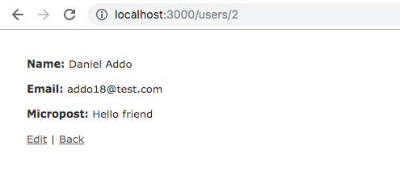

# Toy application using Ruby on Rails

[Michael Hartl's](https://www.learnenough.com/ruby-on-rails-4th-edition-tutorial/beginning) tutorial in setting up and deploying Rails apps.

## Screenshot



## Live version

Follow the link to acess to the live version on heroku: https://sleepy-shelf-00345.herokuapp.com/

## Getting started

To get started with the app, first clone the repo

```
git clone  https://github.com/addod19/toy_app.git
```

Then install the needed gems:

```
bundle install --without production
```

Next, migrate the database:

```
 rails db:migrate
```

Finally, run the app in a local server:

```
 rails server
```

To see more information and learn about Rails check this [Ruby on Rails](https://www.railstutorial.org/book) Tutorial book.
